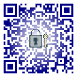

# qr-secret
Share secrets between Linux/macOS/Windows and mobile



## Introduction

The `qr-secret` tool convert passwords and secrets into QR code that is printed on screen to scanned by mobile/tablet to share them (like complex password, SSH key, WiFi secret, etc). The generated QR code will automatically be closed after 10 seconds if you forgot to close it.

A good use case if you don't like hosted password managers services is using `qr-secret` with [KeePassXC](https://keepassxc.org/) which doesn't support plugins (like QR plugin) to share complex passwords with mobile/tablet. Further, [Kaspersky QR Scanner](https://www.kaspersky.de/qr-scanner) could be used to scan the password/secrets on `Android` or `iOS` devices to share the password. 

The tool itself is very minimalistic for simple sharing of secrets, and works on linux and iOS. 

## Installation

To install on linux download either the binary or the binary with desktop launcher from [here](https://github.com/pharmatics/qr-secret/releases):


```bash
# for binary
sudo curl -sSL -o /usr/local/bin/qr-secret https://github.com/pharmatics/qr-secret/releases/download/v1.0.1/qr-secret-linux-amd64
sudo chmod +x /usr/local/bin/qr-secret-linux-amd64

# for full application
sudo curl -sSL -o ~/qr-secret.tar.gz https://github.com/pharmatics/qr-secret/releases/download/v1.0.1/qr-secret-linux-amd64.tar.gz
sudo tar -zxvf qr-secret.tar.gz -C /
```

To install on macOS download the `QRSecret.dmg` from [here](https://github.com/pharmatics/qr-secret/releases), then install the package. You will need to allow the app form `Security and privacy`, because it not signed.